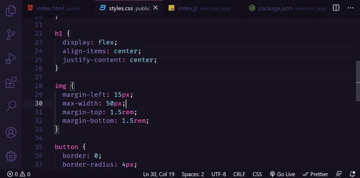

<h3 align="center">
    
</h3>


<p align="center"> :computer: <strong>Em progresso ...</strong> 🚧</p>

<p align="center"> 
   
  
  <a href="https://github.com/IghorMello">
    
  </a>
 
 <a href="https://github.com/IghorMello">
    
  </a>
</p>

<br>

## :pushpin: Índice

- [Sobre](#sobre-o-projeto)
- [Progresso](#progresso)
- [Como executar](#executar)
- [Tecnologias](#tecnologia)
- [Desenvolvido por](#desenvolvido)

<br>

<a id="sobre-o-projeto"></a>

## 💻 Sobre o projeto

:memo: Mini VS Code desenlvovido em ElectronJS
<br><br>
:tada: Projeto baseado nos videos e aulas oferecidas pelo canal [Código Fonte TV](https://www.youtube.com/user/codigofontetv).

<br>

<a id="executar"></a>

## 🚀 Como executar o projeto

### Pré-requisitos

Antes de começar, você vai precisar ter instalado em sua máquina as seguintes ferramentas:
[Git](https://git-scm.com), [Node.js](https://nodejs.org/en/) e o gerenciador de pacotes [Yarn](https://yarnpkg.com/).
Além disto é bom ter um editor para trabalhar com o código, como [VSCode](https://code.visualstudio.com/)

<br>

#### 🧭 Rodando a aplicação

```bash

# Clone esse repositório
$ https://github.com/IghorMello/mini-vscode-electron.git

# Entre na pasta
$ cd mini-vscode-electron

# Instale as depedências
$ yarn

# Rode o comando
$ yarn start

```

<br>

<a id="tecnologia"></a>

## 🛠 Tecnologias

As seguintes ferramentas foram usadas na construção do projeto:

- [React.js](https://reactjs.org)
- [Node.js](https://nodejs.org/en/)
- [Electron](https://www.electronjs.org/)
